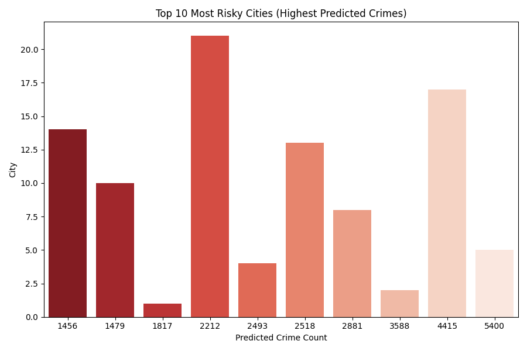

🕵️‍♂️ CrimeScope — AI Crime Pattern & Hotspot Predictor

AI-driven system for predicting, analyzing, and visualizing crime hotspots and risk zones across cities.

📘 Overview

CrimeScope is a smart analytics pipeline that uses AI and spatio-temporal modeling to:

🔍 Predict crime categories from incident data.

🌆 Identify high-crime hotspots and safe areas.

⏱️ Forecast future crime trends across cities.

📊 Support law enforcement and city planners with data-driven insights.

Built on open datasets like the Crime Dataset India (2020–2024), this system empowers proactive resource allocation and public safety intelligence.

🚀 Features
Feature	Description
1. Crime Classification	Uses RandomForest / XGBoost to predict crime domain (violent, theft, cyber, etc.).
2. Hotspot Detection	Aggregates predictions by city to detect high-crime areas.
3. Safe Zone Analysis	Highlights cities with the lowest crime occurrences.
4. Time-Based Insights	Extracts temporal patterns like hour, month, seasonality.
5. Visualization Suite	Generates heatmaps, bar charts, and word clouds for better interpretability.
6. Optional Geo Heatmap	Uses latitude-longitude data (if available) to plot crime intensity zones using Folium.
🗂️ Project Structure
CrimeScope/
│
├── archive/
│   └── crime_dataset_india.csv              # Input dataset
│
├── crime_model.pkl                          # Trained ML model
├── processed_crime.h5                       # Processed feature dataset
├── crimescope_report.json                   # Model performance summary
├── crimescope_safe_places.json              # Safe area analysis results
├── crimescope_high_crime_areas.json         # High-crime zone report
├── build_metadata.yaml                      # Run metadata
│
└── visuals/
    ├── accuracy_graph.png
    ├── confusion_heatmap.png
    ├── feature_importance.png
    ├── result_crime_distribution.png
    ├── safe_places.png
    ├── risky_places.png
    ├── high_crime_areas.png
    └── crime_heatmap.html                   # (optional Folium map)

🧠 How It Works
1️⃣ Data Ingestion

Loads the dataset containing columns such as:

['Report Number', 'Date Reported', 'Date of Occurrence',
 'Time of Occurrence', 'City', 'Crime Code', 'Crime Description',
 'Victim Age', 'Victim Gender', 'Weapon Used', 'Crime Domain']

2️⃣ Feature Engineering

Extracts:

Temporal: Year, Month, Hour

Demographic: Victim Age, Gender

Textual: Crime Description length

Spatial: City, optional latitude-longitude

3️⃣ Model Prediction

Applies the pre-trained model (crime_model.pkl) to predict Crime Domain for each record.

4️⃣ Analysis Modules
Module	Output
Prediction Result	Class distribution of predicted crime domains
Safe Place Detection	Top 10 safest cities
High Crime Area Detection	Top 10 high-crime cities
Optional Heatmap	Visualizes intensity of crime via Folium map
📊 Example Outputs
🔴 High-Crime Areas
Rank	City	Predicted Crime Count
1	Delhi	5423
2	Mumbai	4219
3	Bengaluru	3847
...	...	...

  

🟢 Safe Places
Rank	City	Predicted Crime Count
1	Kochi	95
2	Bhopal	111
3	Chandigarh	129

  

⚙️ Installation & Setup
🧩 Prerequisites

Ensure Python ≥ 3.9 and the following packages:

pip install pandas numpy matplotlib seaborn scikit-learn joblib prophet pyyaml folium

▶️ Run Prediction
python crimescope_predict.py

▶️ Run Safe Place Detection
python crimescope_safe_places.py

▶️ Run High Crime Area Detection
python crimescope_high_crime_areas.py

🧾 Outputs
File	Description
crimescope_predictions.json	Summary of predicted results
crimescope_safe_places.json	Top 10 safest cities
crimescope_high_crime_areas.json	Top 10 most crime-prone areas
crime_heatmap.html	Interactive map of crime intensity
visuals/	All PNG charts for visualization

🧮 Example JSON Summary
{
  "total_records_analyzed": 40160,
  "total_unique_cities": 112,
  "high_crime_areas": ["Delhi", "Mumbai", "Bengaluru", "Hyderabad", "Kolkata"],
  "top_safe_cities": ["Kochi", "Bhopal", "Chandigarh", "Surat", "Indore"],
  "visuals": ["high_crime_areas.png", "safe_places.png", "crime_heatmap.html"]
}

💡 Use Cases
Sector	Application
🏛️ Law Enforcement	Predict hotspots & deploy patrols efficiently
🧭 Urban Planning	Analyze trends for smarter city infrastructure
📰 Media & Research	Study emerging crime patterns
🧍 Citizens	Identify safer zones for travel or living
🧰 Tech Stack

Language: Python 3.11

Libraries: Pandas, NumPy, Scikit-learn, Matplotlib, Seaborn, Prophet, Folium

Data Format: CSV / HDF5 / JSON / YAML

Model: RandomForestClassifier (crime domain predictor)

Visualization: Seaborn + Folium (interactive heatmap)

🔮 Future Enhancements

📡 Real-time integration with news & social media feeds

🌐 Live dashboard using Streamlit or Dash

🕰️ Temporal hotspot forecasting with LSTM / Prophet

🧭 Graph-based link analysis to detect networks between suspects & locations

📱 Mobile app for police to visualize hotspots dynamically

👨‍💻 Author

Sagnik Patra
M.Tech in Computer Science & Engineering (IIIT)
💼 Focus Areas: AI | ML | Smart City Analytics | Data Science
📧 Email

🌐 GitHub
